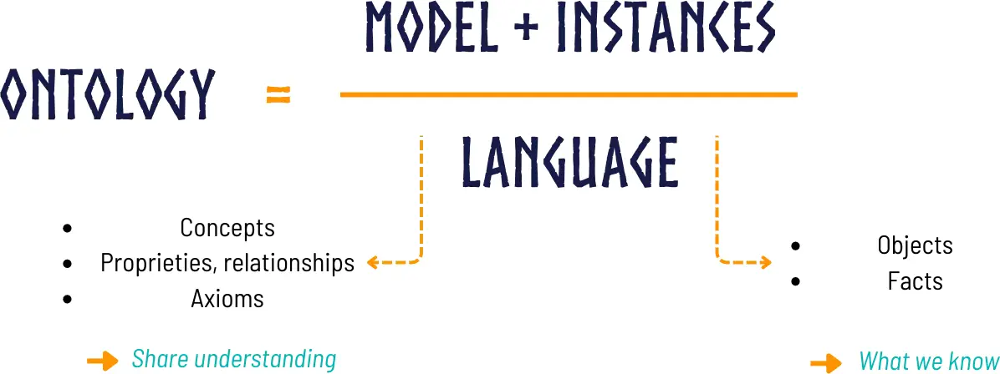
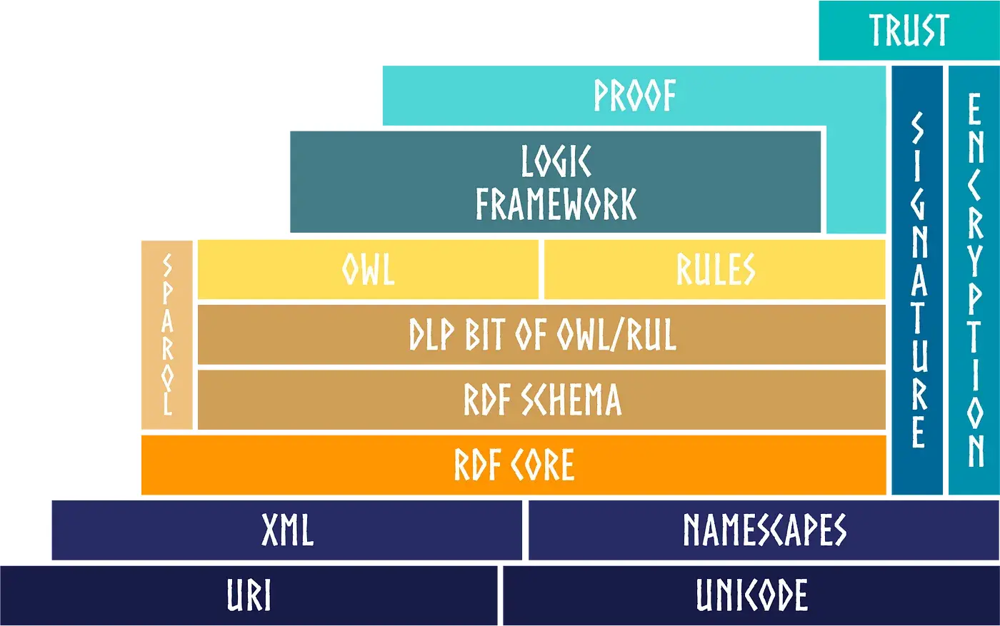
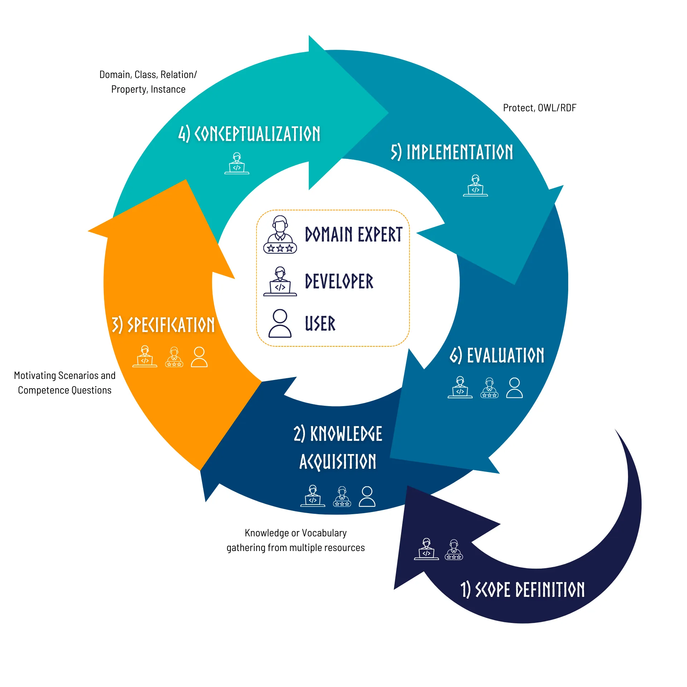

# OKP4 Ontology

> The ontology used [@okp4](okp4.network) to describe knowledge data, services and processes in the OKP4 platform.

[](https://github.com/okp4/ontology/releases)
[](https://github.com/okp4/ontology/actions/workflows/lint.yml)
[](https://github.com/okp4/ontology/actions/workflows/build.yml)
[](https://github.com/okp4/ontology/actions/workflows/test.yml)
[](https://github.com/okp4/ontology/actions/workflows/publish.yml)
[](https://conventionalcommits.org)
[](https://github.com/okp4/.github/blob/main/CODE_OF_CONDUCT.md)
 [![cc-by-sa-4.0][cc-by-sa-image]][cc-by-sa]

## The [OKP4](https://okp4.network) ontology

This ontology defines and specifies the various schemas and vocabularies employed in the [OKP4 protocol](https://okp4.network), utilizing a formal and standardized methodology.

Essentially, the OKP4 ontology is structured around two primary dimensions.

### The Semantic Dimension

An [Ontology](https://www.w3.org/standards/semanticweb/ontology), as defined by the [W3C](https://www.w3.org), is a foundational and broad concept of the [Semantic Web](https://en.wikipedia.org/wiki/Semantic_Web). It connects various data elements, providing a conceptual semantic framework about them. Typically, an ontology consists of concepts, relationships, properties, axioms, and instances.

<p align="center">
  
</p>

The knowledge representation language chosen for OKP4 is [RDF Schema](http://www.w3.org/TR/rdf-schema/), and [SKOS](https://www.w3.org/TR/skos-reference/) for thesauri, both of which are built on top of the framework [Resource Description Framework](http://www.w3.org/TR/rdf-concepts/).

<p align="center">
  
</p>

In this framework, the OKP4 ontology is dedicated to constructing a semantic network that encapsulates various resources, such as Zones, Digital Resources, Digital Services, to name a few. It focuses on semantically defining these entities and elucidating the interconnections they share.

### The Trust and Proof Dimension

This particular aspect of the ontology addresses the representation of information related to resources using [Verifiable Credentials](https://www.w3.org/TR/vc-data-model/#what-is-a-verifiable-credential) (VCs). VCs play a critical role in asserting properties about subjects, which, within the framework of this ontology, are considered resources. These resources can be varied, like Zones, Digital Resources or Digital Services.

In the context of the OKP4 ontology, each resource is uniquely identified by [Decentralized Identifiers](https://www.w3.org/TR/did-core/) (DIDs). DIDs are a key component in the decentralized identity ecosystem, providing a mechanism for establishing and verifying the identity of a resource without centralized control. This identification system is integral to the structure and function of the ontology, ensuring that each resource is distinct, easily identifiable and easily traceable.

The use of VCs in this framework brings several advantages. Firstly, VCs allow for the assertion of specific properties about a resource. This means that each resource can carry with it a set of verifiable information, detailing its characteristics, and any other relevant attributes. Secondly, because VCs are inherently designed to be tamper-evident and cryptographically secure, they enhance the reliability and transparency of the information they convey, ensuring integrity and clarity in both off-chain and on-chain contexts.

This approach results in a more reliable and robust system, where the data about resources, backed by the claims from Verifiable Credentials, can be shared and used with confidence. These claims, being trusted sources of information, are instrumental for decision-making in established on-chain Governance rules.

## At the heart of the OKP4 blockchain

In the [OKP4 protocol](https://okp4.network), the ontology is crucial, especially as key data is introduced to the blockchain in the form of [Verifiable Presentations](https://www.w3.org/TR/vc-data-model/#presentations) (VPs). VPs, often a selected subset of [VCs](https://www.w3.org/TR/vc-data-model/#what-is-a-verifiable-credential) with a verifiable chain, serve as the medium for conveying knowledge to the blockchain.

This process is integral in ensuring that the semantics of nearly all transactions, which describe the Dataverse on the blockchain, are captured within this ontology framework. As a result, significant activities within the OKP4 ecosystem —such as the establishment of a Zone, the announcement of a Digital Service, or the description of a Dataset— are communicated through these Verifiable Presentations.

The use of VPs in this context is not merely a procedural step; it introduces a profound layer of semantic precision and trust. This is crucial for the blockchain environment, where clarity and verifiability are paramount. Furthermore, the data presented on-chain through VPs become vital resources for on-chain governance decisions. They provide a reliable basis for the formulation and execution of governance rules, ensuring that decisions are made on the basis of verified and accurate information. Thus, the integration of VPs into the [OKP4 protocol](https://okp4.network)'s ontology enhances both the functionality and the integrity of the system.

## Ontology Design

### Ontology construction process

The construction of this ontology follows a number of steps which are described below:

- __Ontology scope definition (1) & knowledge acquisition (2)__: Identification and definition of key concepts and relationships in the domain of interest and the terms that refer to such concepts, in natural language.
- __Ontology specification (3) & conceptualization (4)__: Formalizing of the elements identified in the previous step in the form of a knowledge representation, using the building blocks of ontologies: classes, attributes, relationships, subsumption.
- __Ontology implementation (5)__: Encoding the ontology according to the OWL grammar.
- __Ontology evaluation (6)__: Association of key concepts and terms in the ontology with concepts and terms of other ontologies.

<p align="center">
  
</p>

### Ontology organization

This ontology is structured in a modular way, with each part representing a specific domain of knowledge, providing a clear *separation of concerns* and a maximum of *extensibility*.

At the root, the ontology is divided into two main parts:

- __Thesaurus Part__: This part contains all controlled vocabularies integral to the ontology. The thesaurus adheres to the [SKOS standard](https://www.w3.org/TR/skos-reference/), which is instrumental in ensuring compatibility with other thesauri and simplifying the ontology's integration into various systems.

- __Schema Part__: This part encompasses diverse Verifiable Credentials schemas utilized within the [OKP4 protocol](https://okp4.network). These schemas are deployed as [JSON-LD contexts](https://www.w3.org/TR/json-ld11/), a format that maximizes their usability in the Web3 ecosystem and promotes interoperability with existing Digital Credentials Wallets.

The foundational philosophy underpinning the ontology of the [OKP4 protocol](https://okp4.network) is grounded in the *Open World* principle. This principle operates on the premise that knowledge is not static or finite; rather, it acknowledges that understanding and information can continuously evolve and expand. In practical terms, this means that the ontology is not confined to a predefined or limited set of schemas and thesauri. Instead, it is inherently designed to accommodate and integrate new and diverse contributions.

### Ontology versioning

In managing [RDF](https://www.w3.org/RDF/) resources, it is essential to balance the stability of URIs with the stability of their referenced content:

- _URI Stability_: URIs must remain constant over time. This ensures that each URI consistently references the same resource, providing a reliable point of reference in web-based knowledge systems.
- _Content Stability_: The content accessed via these URIs should be stable and avoid introducing breaking changes. This stability is crucial for 3rd party systems referencing these URIs, ensuring that their interactions remain consistent.

The OKP4 ontology adopts the [Semantic Versioning](https://semver.org/) format of `MAJOR.MINOR.PATCH`. This approach includes incorporating the `MAJOR` version number into the ontology's URI. As a result, the structure of the ontology's URI is:

```text
https://w3id.org/okp4/ontology/<MAJOR>/<path>
```

Note: by including only the `MAJOR` version number in the URI, significant updates that could impact compatibility gives a new ontology version being referenced with a different namespace. `MINOR` updates and `PATCH` (which do not result in breaking changes) have no impact on the URI, maintaining the stability of the URI for external references.

## Development

### Building the ontology

The ontology is built using [GNU make](https://www.gnu.org/software/make/manual/make.html) and [Docker](https://www.docker.com/).
To build the ontology, run the following command:

```bash
make build
```

This will build the `okp4` ontology under the `target` directory. The files generated have different [RDF](https://www.w3.org/RDF/) formats:

- [Turtle](https://www.w3.org/TR/turtle/)
- [N-Triples](http://www.w3.org/TR/n-triples/)
- [RDF/XML](https://www.w3.org/TR/rdf-syntax-grammar/)
- [JSON-LD](https://www.w3.org/TR/json-ld11/)) to be used in different contexts.
- [Tarball](https://en.wikipedia.org/wiki/Tar_(computing)) containing all the different ontology formats.

```text
./target
   ├── okp4-ontology-<version>.nt
   ├── okp4-ontology-<version>.rdf.xml
   ├── okp4-ontology-<version>.jsonld
   ├── okp4-ontology-<version>.ttl
   └── okp4-ontology-<version>-bundle.tar.gz
```

### Deploying the ontology in local triple store

The ontology can be deployed in a local triple store using [Docker](https://www.docker.com/). The triple store used is [Apache Jena Fuseki](https://jena.apache.org/documentation/fuseki2/).

To start the triple store, run the following command. This will start the triple store and wait to be ready.

```bash
make fuseki-up
```

Then, you can load the `okp4` ontology in the triple store using the following command:

```bash
make fuseki-load
```

You can now play with the ontology using the Fuseki UI - <http://localhost:3030/>.

Conversaly, to stop the triple store, run the following command:

```bash
make fuseki-down
```

⚠️ Note that the triple store is *not persistent*, so all the data will be *lost* when the triple store is stopped.

### Testing the ontology

The ontology is tested using [Shapes Constraint Language (SHACL)](https://www.w3.org/TR/shacl/). To run the tests, run the following command:

```bash
make test
```

### Generating the documentation

The documentation is generated using the following command:

```bash
make docs
```

This will generate the documentation under the `docs` directory. Don't forget to commit the generated files.

### Other commands

You can get the list of all available commands by running the following command:

```bash
make help
```

Which will output the following:

```text
Usage:
  make <target>

Targets:
  Clean:
    clean                 Clean all generated files
  Build:
    build                 Build all the files
    build-ontology        Build the ontology in all available formats (N-Triples, RDF/XML, JSON-LD)
    build-ontology-ttl    Build the ontology in Turtle format
    build-ontology-nt     Build the ontology in N-Triples format
    build-ontology-rdfxml Build the ontology in RDF/XML format
    build-ontology-jsonld Build the ontology in JSON-LD format
    build-ontology-bundle Build a tarball containing the segments and the ontology in all available formats (N-Triples, RDF/XML, JSON-LD)
  Format:
    format                Format with all available formatters
    format-ttl            Format all Turtle files
  Lint:
    lint                  Lint with all available linters
    lint-ttl              Lint all Turtle files
  Documentation:
    docs                  Generate all available documentation
    docs-schemas          Generate schemas markdown documentation
  Test:
    test                  Run all available tests
    test-ontology         Test the ontology
  Fuseki:
    fuseki-up             Start a Fuseki server and wait for it to be ready
    fuseki-down           Stop the Fuseki container
    fuseki-load           Load the ontology in Fuseki server
    fuseki-log            Show Fuseki server logs
  Misc:
    cache                 Download all required files to cache
    check                 Check if all required commands are available in the system
    version               Show the current version
  Help:
    vars                  Show relevant variables used in this Makefile
    help                  Show this help.

This Makefile depends on docker. To install it, please follow the instructions:
- for macOS: https://docs.docker.com/docker-for-mac/install/
- for Windows: https://docs.docker.com/docker-for-windows/install/
- for Linux: https://docs.docker.com/engine/install/
```

## Contributing

Contributions are welcome. Please check the following guidelines:

- [Contributing](https://github.com/okp4/.github/blob/main/CONTRIBUTING.md)
- [Code of conduct](https://github.com/okp4/.github/blob/main/CODE_OF_CONDUCT.md)

[cc-by-sa]: https://creativecommons.org/licenses/by-sa/4.0/
[cc-by-sa-image]: https://i.creativecommons.org/l/by-sa/4.0/88x31.png

## License

The ontology and related assets (markdown documentation, images, etc.) are licensed under a [CC-BY license](LICENSE).

All other code in this repository is licensed under the [BSD-3-Clause license](LICENSE-CODE).
